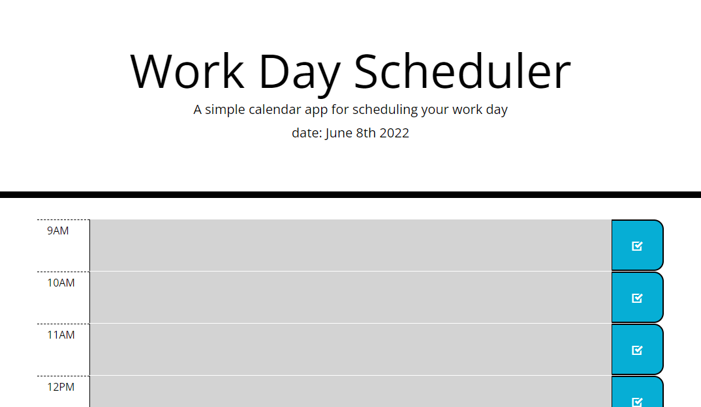

# work-day-schedule

[Deployed App: ](https://bgeertsen.github.io/work-day-schedule/)

##Simple schedule app to save tasks or events for each hour of a standard workday. 

##The background for each hour slot is color coded. Grey backgrounds are applied to hours that have already past. Red for the current hour and green is applied to the hours that are left in the day.